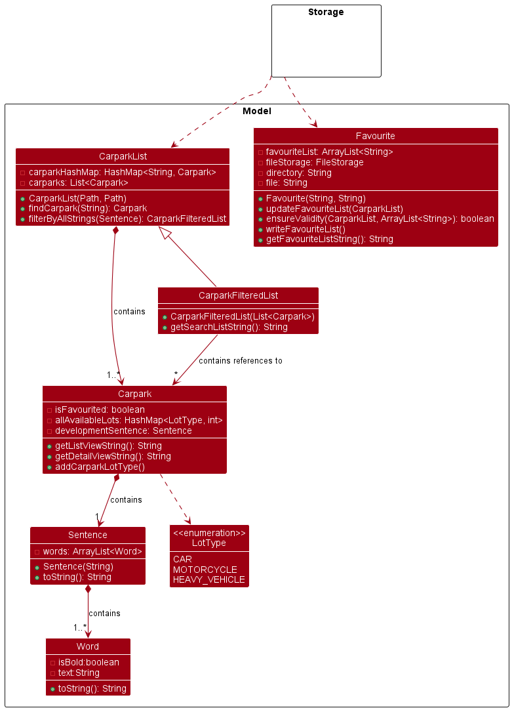

# Developer Guide

## Acknowledgements

`.puml` styles reused from SE-EDU project [Address Book Level 3](https://github.com/se-edu/addressbook-level3/)

{list here sources of all reused/adapted ideas, code, documentation, and third-party libraries -- include links to the original source as well}

## Design 

### Architecture Level

### Component Level

#### Model Component

The model component consists of a `CarparkList` (and `CarparkFilteredList`) class that contains
instances of `Carpark`, under the package `seedu.data`. 

This component: 
* Stores all carpark data (all `Carpark` objects), contained in a `CarparkList` object.
* Stores filtered carpark data to be used in other components (in `CarparkFilteredList`).
* Contains methods for selecting a `Carpark` object based on a unique code (for the `find` command) as well
as filtering by a substring or set of substrings (`search` command).
* Is independent of other components except the API component, which is used to generate it.
* Groups objects with the same code by enum `LotType` (Car, Motorcycle, Heavy Vehicle) and places them in a HashMap 
for easy access. For example: Three `carpark` objects may have the same unique carpark code as they are the same carpark,
but contain available lot information for different types of lot. These three objects will be grouped under one object
with the HashMap `allAvailableLots` containing a breakdown of lots by type.

Note: The `Carpark` class contain many getters, setters and annotations to be used with the `jackson` module. 
See [`FileLoader`](#FileLoader) for more information.

#### API Component

Fetching data from LTA API

#### Storage Component

##### FileWriter

##### FileLoader

#### UI Component

User-facing parts of the program

#### Logic Component

Parsing, commands

#### Common Files

## Implementation

## Product scope
### Target user profile

{Describe the target user profile}

### Value proposition

{Describe the value proposition: what problem does it solve?}

## User Stories

|Version| As a ... | I want to ... | So that I can ...|
|--------|----------|---------------|------------------|
|v1.0|new user|see usage instructions|refer to them when I forget how to use the application|
|v2.0|user|find a to-do item by name|locate a to-do without having to go through the entire list|

## Non-Functional Requirements

{Give non-functional requirements}

## Glossary

* *glossary item* - Definition

## Instructions for manual testing

{Give instructions on how to do a manual product testing e.g., how to load sample data to be used for testing}
