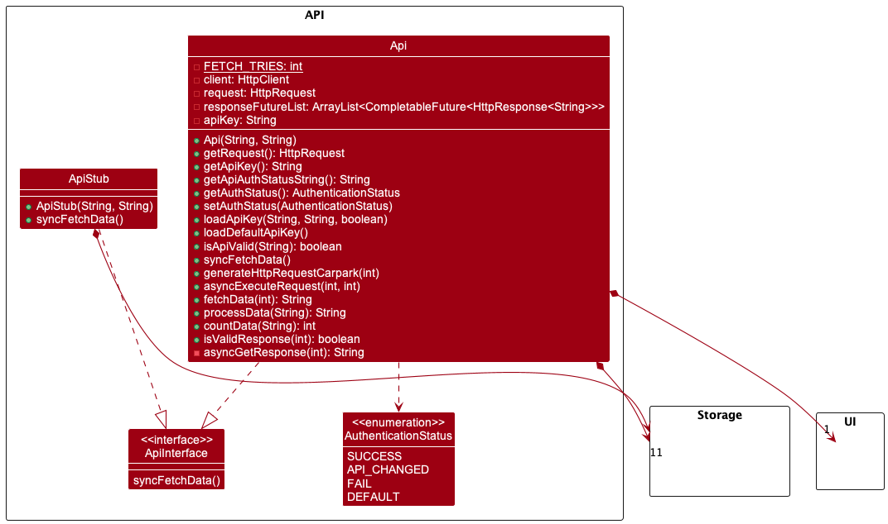

# Developer Guide

## Acknowledgements
Our project uses external libraries and services from:
1. Land Transport Authority DataMall API Service ([link](https://datamall.lta.gov.sg/content/datamall/en.html)).
2. Jackson JSON Parser ([link](https://fasterxml.github.io/jackson-core/javadoc/2.8/com/fasterxml/jackson/core/JsonParser.html))

## Design 

### Architecture Level

### Component Level

#### Model Component

The model component consists of a `CarparkList` (and `CarparkFilteredList`) class that contains
instances of `Carpark`, under the package `seedu.data`. 

This component: 
* Stores all carpark data (all `Carpark` objects), contained in a `CarparkList` object.
* Stores filtered carpark data to be used in other components (in `CarparkFilteredList`).
* Contains methods for selecting a `Carpark` object based on a unique code (for the `find` command) as well
as filtering by a substring or set of substrings (`search` command).
* Is independent of other components except the API component, which is used to generate it.
* Group objects with the same code by enum `LotType` (Car, Motorcycle, Heavy Vehicle) and places them in a HashMap 
for easy access. For example: Three `carpark` objects may have the same unique carpark code as they are the same carpark,
but contain available lot information for different types of lot. These three objects will be grouped under one object
with the HashMap `allAvailableLots` containing a breakdown of lots by type.

Note: The `Carpark` class contain many getters, setters and annotations to be used with the `jackson` module. 
See [`FileLoader`](#FileLoader) for more information.

#### API Component

The model component consists of a `Api` class that supports API call to LTA DataMall Services, under the
package `seedu.api`.

This component:
* Focuses on communicating with an external Api by using HTTP requests. 
* JSON response will be stored in the local JSON file as long as the response is `200 OK` and not empty.
* Only reads from the secret.txt file once and stores the API as a variable (will only read from the file
if requested again).

How the API component of data fetching works
1. The initialisation of the class will make an instance of the `Storage`, `HttpClient` and `Ui` class.
2. If the program just started, the Parking class will call the `loadApiKey` method.
   - If no file called `secret.txt` is found, file will be created.
   - If the file is empty, default key will be loaded to the Api instance (but not written to the local file).
3. To get data from the Api Service,
   - Call `asyncExecuteRequest` method to construct the Http request packet header and sends the request
     asynchronously.
   - Call `fetchData` method to get response immediately from the Api.
      - This method will also validate the response from the Api by identifying the response code.
      - Unless its 401 Unauthorised Access (due to invalid Api key), the method will try to fetch data
        at most 5 times.
      - If data is valid and not empty, it will write the data to the local JSON file.

The API component is also able to:
- Loads in key from a local file storage (in txt format).
- Authenticate user API key. If no user key inputted, default key will be loaded.
- Get API authentication status.
- Do synchronous data fetching.
   - Done by combining step 2 and 3 above.

##### [Proposed] Append parameters to the HTTP request
The current LTA Api only provides up to 500 data set per request. We can get the next 500 set of data by appending a
`$skip` parameter to the end of the URL. It requires an additional parameter on the `generateHttpRequestCarpark()`
method and concatenating data set of multiple HTTP responses.
Fetching data from LTA API

#### Storage Component

##### FileWriter

##### FileLoader

#### UI Component

User-facing parts of the program

#### Logic Component

How the authentication works:
* When the user fails to authenticate his inital `API_KEY`, he can use the `auth` Command to authenticate his `API_KEY`. 
* If the `API_KEY` is valid, then the program will reload the corresponding JSON file and `fetchData()` from the 
authenticated API file.

How the parsing works:

* When called upon to parse a user command, the `Parser` class creates an `ABCCommandParser` (`ABC` is a placeholder 
for the specific command name eg. `FindCommandParser`) which uses the other classes to parse the user command and
create an `ABCCommand` object (eg. `FindCommand`), which the `Parser` returns back as a `Command` object.

* All `ABCCommandParser` classes (eg. `FindCommandParser`, ``SearchCommandParser` etc) inherit from the `Parser` 
interface so that they can be treated similarly where possible.

How the command works:

* When the `Parser` returns back as a `Command` object, it will run `execute`, which is a method to execute the command
and return the intended result. `Execute` returns a `CommandResult`, which is an object that takes in `String` and
`CarparkList` and returns what the user will be seeing on the terminal.
* Each command will have its own class `ABCCommand` (`ABC` is a placeholder for the specific command name eg. 
`FindCommand`) as an extension of the `Command` class.
* All `ABCCommand` classes will have an override `execute` method, which will override the `execute` method in `Command` 
and return the respective `CommandResult` result of the Command.

#### Common Files

## Implementation

## Product scope
### Target user profile

{Describe the target user profile}

### Value proposition

{Describe the value proposition: what problem does it solve?}

## User Stories

|Version| As a ... | I want to ... | So that I can ...|
|--------|----------|---------------|------------------|
|v1.0|new user|see usage instructions|refer to them when I forget how to use the application|
|v2.0|user|find a to-do item by name|locate a to-do without having to go through the entire list|

## Non-Functional Requirements

{Give non-functional requirements}

## Glossary

* *glossary item* - Definition

## Instructions for manual testing

{Give instructions on how to do a manual product testing e.g., how to load sample data to be used for testing}
